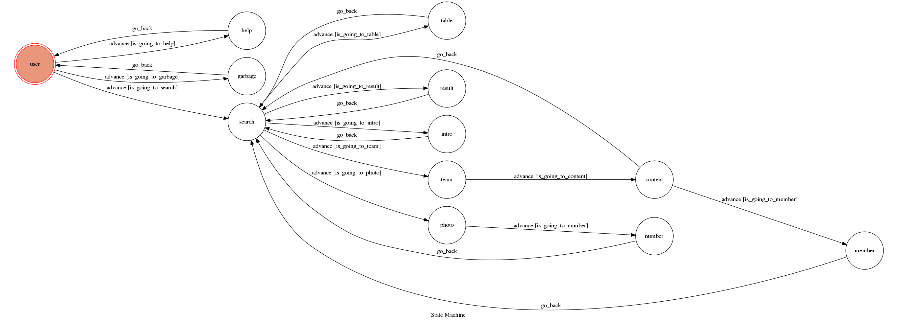

# ChatBot
**This is a interesting chatbot that you can know more about TVL(Top Volleyball League).**

Before you interact with the chatbot, you have to run it.
Here are the steps:

*	install BeautifulSoup
```sh
pip install beautifulsoup4
```
 * Download ngrok and run it
```sh
$ ./ngrok http 5000
```
 * Copy WEBHOOK_URL(blue one) and paste to app.py   
   *ex: Forwarding	<span style="color:blue;"> _https://12345678.ngrok.io </span>-> localhost:5000*<p>
   
 * Then run app.py
```sh
$ python3 app.py
```
 * Use your telegram to search @TaiwanVolleyball_bot
 
 * Finally, you can interact with my chatbot

## Basic function

使用者可隨便輸入，機器人會回傳圖片及說明。正常指令包含：
*	help：幫助使用者了解如何操作
*	search：進入查詢的階段，使用者可以**按鈕**或**打字**回答

## Advanced function

*	使用**BeautifulSoup**抓取網頁內容
*	使用**reply_photo**以及**telegram.ReplyKeyboardMarkup**()等function
*	使用random回覆使用者不正確的輸出，並加入**圖片**為輸出
* 文字即是超連結，可直接點選進入網頁

## Finite State Machine

